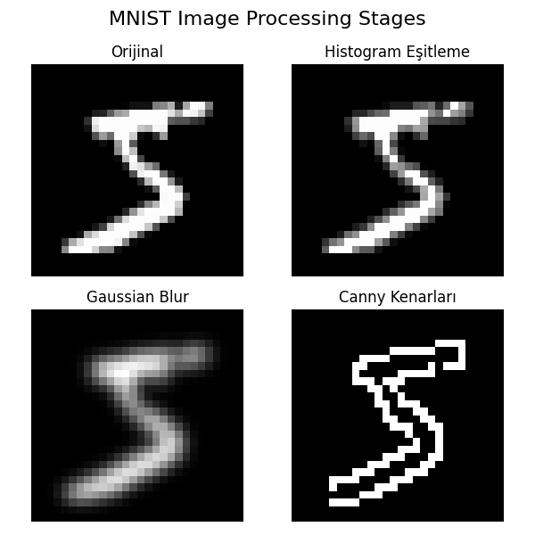
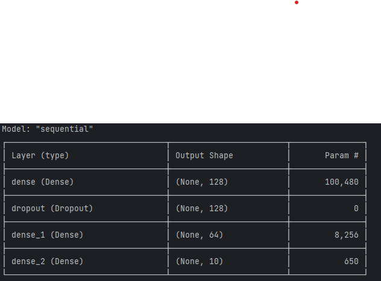
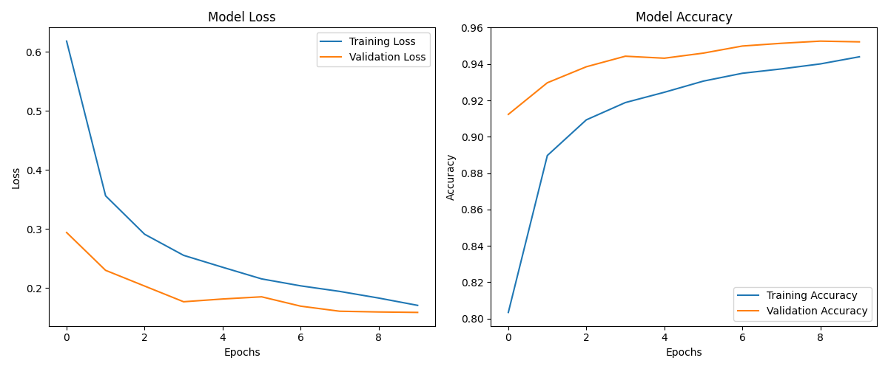
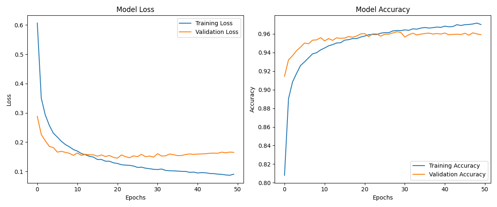

# 🧠 MNIST Digit Classification: Image Processing & ANN

In this project, I developed a model to recognize handwritten digits from the **MNIST** dataset using **OpenCV** for image preprocessing and **Artificial Neural Networks (ANN)** for classification. The primary role of OpenCV in this project was to sharpen the outlines of the digits, making it easier for the model to learn during the training phase.

## 🚀 Project Summary
* **Image Preprocessing:** Techniques such as Histogram Equalization, Gaussian Blur, and Canny Edge Detection were applied to the data.
* **Model Architecture:** An effective 4-layer Artificial Neural Network (ANN) was established using TensorFlow and Keras.
* **Comparative Tests:** Results from 10 epochs and 50 epochs were compared to analyze the model's learning stability.

---

## 🖼️ 1. Image Preprocessing Stages
I selected a random image from the dataset (`x_train[0]`) and applied preprocessing steps sequentially. To observe the effect of each step, I visualized them in a 2x2 grid structure:

---

## 🧠 2. Model Structure
The neural network consists of 4 fundamental layers designed to interpret data and improve accuracy:

| Layer | Function |
| :--- | :--- |
| **1st Layer: Dense (128)** | Receives preprocessed pixel data and identifies initial complex features through 128 neurons. |
| **2nd Layer: Dropout (0.2)** | Randomly "shuts down" 20% of neurons during training to prevent the model from memorizing data (**Overfitting**). |
| **3rd Layer: Dense_1 (64)** | Refines information from the first layer to interpret finer details like curved lines and straight edges. |
| **4th Layer: Dense_2 (Output)** | Consists of 10 neurons representing digits 0-9; each neuron calculates the probability for its respective digit. |

---

## 📈 3. Results Obtained
The impact of training duration (epochs) on model performance was observed as follows:

### Case A: 10 Epochs Result
Training started, but the duration was insufficient for the model to reach its full potential. The model showed a tendency toward memorization (overfitting) rather than genuine learning due to limited time.

### Case B: 50 Epochs Result (96.09% Success)
By the end of 50 epochs, the model achieved a **96.09% accuracy rate**. The learning curve became significantly more stable and reliable compared to the 10-epoch run.

---
> **Note:** I developed this project as part of my learning journey on the **BTK Academy** platform. While the documentation is in English for global accessibility, the code comments remain in Turkish as they reflect my original study notes.
---
