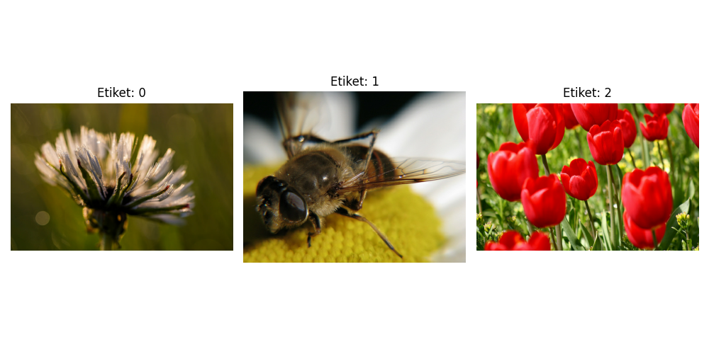
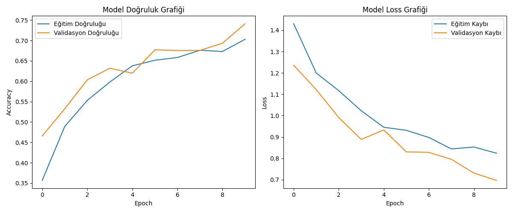

#  🧠 Flower Type Classification: Image Processing & CNN

In this project, I developed a deep learning model to classify flowers from the tf_flowers dataset into 5 distinct categories using Convolutional Neural Networks (CNN). To enhance the model's performance, I implemented a robust pipeline that preserves the color complexity (RGB) of images while utilizing advanced Data Augmentation techniques.

## 🚀 Project Summary
* Data Structure: The images consist of 3 channels (RGB), confirming they are processed in full color.
* Advanced Augmentation: To improve the model's generalization, I applied techniques such as random brightness, contrast adjustments, and random cropping.
* Model Architecture: A sequential structure featuring 3 Conv2D layers and a 50% Dropout rate to prevent overfitting.
* Modern Storage: The model is saved in the native .keras format, offering significant advantages in security and performance.

---

## 🖼️ 1. Image Preprocessing Stages
To ensure the model learns from various perspectives and lighting conditions, I utilized the tf.image library. This process creates multiple variations of each image, preventing the model from simply memorizing the training data.

---
## 🧠 2. Model Structure
The neural network is designed with a hierarchical structure to learn visual features from simple edges to complex floral patterns:
| Layer | Function |
| :--- | :--- |
| **1st Stage: Conv2D (32, 64, 128)** | [cite_start]Extracts hierarchical features from RGB images, ranging from simple edges to complex floral patterns[cite: 1]. |
| **2nd Stage: MaxPooling2D** | Reduces spatial dimensions of feature maps, preserving essential information while decreasing computational load. |
| **3rd Stage: Dense (128) & Dropout (0.5)** | Processes high-level features through 128 neurons; **Dropout** prevents the model from memorizing data (**Overfitting**). |
| **4th Stage: Dense (Output)** | [cite_start]Contains 5 neurons representing the flower species; uses Softmax to calculate class probabilities[cite: 1]. |

---
## 📈 3. Training Results (10 Epoch Analysis)
The model's progress throughout the 10-epoch training phase was monitored with the following key observations:
* Initial Phase (Epoch 1): Started with a training accuracy of 36.31% and a loss of 1.4070.
* Learning Rate Adjustment: After Epoch 8, as performance plateaued, the ReduceLROnPlateau callback automatically reduced the learning rate to 0.0002 for finer weight updates.
* Final Success: By Epoch 10, the model achieved a balanced success with 69.52% training accuracy and 69.48% validation accuracy.

---
## 💾 4. Technical Note: Why .keras Instead of .h5?
While .h5 is a traditional format, I opted for the modern .keras format for several critical technical reasons:
1. Security: Unlike .h5 files, which may be vulnerable to external code execution, .keras is an isolated and more secure format.
2. Full Portability: It provides superior packaging for custom layers and training configurations.
3. Speed & Optimization: Model loading and saving operations are significantly more optimized in this native format.
