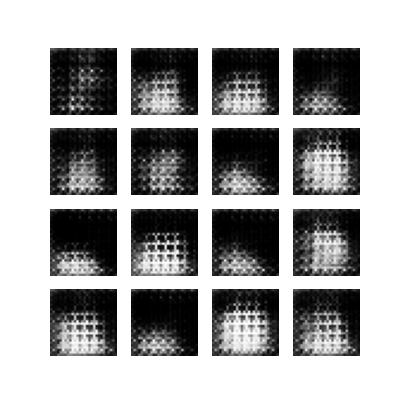
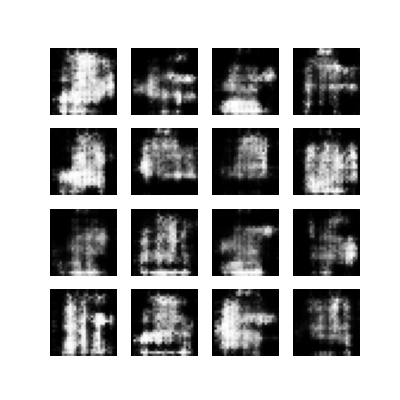
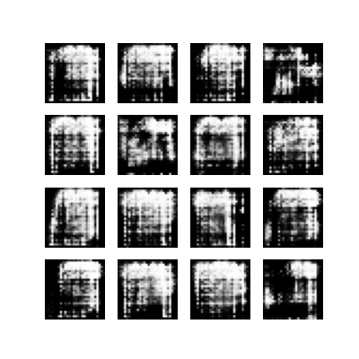
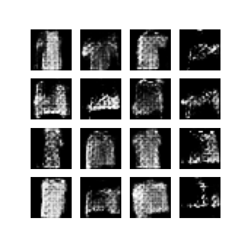
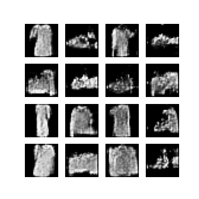
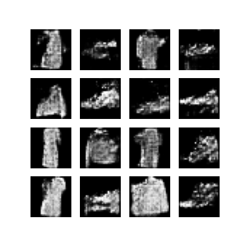

# 👗 Fashion Product Design with GAN (Generative Adversarial Network)

In this project, I developed a GAN model to generate synthetic fashion product images using the Fashion MNIST dataset. The Generator learns to produce realistic-looking clothing images from random noise, while the Discriminator learns to distinguish between real and fake images.

---

## 🚀 Project Summary

- **Model Architecture:** GAN (Generator + Discriminator)
- **Dataset:** Fashion MNIST — 60,000 grayscale images across 10 classes
- **Task:** Generating synthetic fashion product images from random noise
- **Training:** 100 epochs, batch size 128
- **Best Results:** Epochs 60–80

---

## 🏷️ 1. Dataset

Fashion MNIST consists of 28x28 grayscale images belonging to 10 classes:

| Label | Class |
|---|---|
| 0 | T-shirt/top |
| 1 | Trouser |
| 2 | Pullover |
| 3 | Dress |
| 4 | Coat |
| 5 | Sandal |
| 6 | Shirt |
| 7 | Sneaker |
| 8 | Bag |
| 9 | Ankle Boot |

---

## 🧠 2. Model Architecture

GAN consists of two competing models that train against each other:

### Generator
Takes random noise as input and produces fake images:

| Layer | Output Shape | Function |
|---|---|---|
| Dense | (7×7×256) | Converts noise vector into feature map |
| BatchNormalization + LeakyReLU | — | Stabilizes training |
| Reshape | (7, 7, 256) | Reshapes to 3D feature map |
| Conv2DTranspose (128) | (7, 7, 128) | Refines features |
| Conv2DTranspose (64) | (14, 14, 64) | Upsamples to 14×14 |
| Conv2DTranspose (1, tanh) | (28, 28, 1) | Outputs final image in [-1, 1] range |

### Discriminator
Takes an image as input and predicts whether it is real or fake:

| Layer | Function |
|---|---|
| Conv2D (64) | Extracts low-level features, downsamples to 14×14 |
| LeakyReLU + Dropout | Prevents overfitting |
| Conv2D (128) | Extracts deeper features, downsamples to 7×7 |
| LeakyReLU + Dropout | Prevents overfitting |
| Flatten + Dense (1) | Outputs real/fake probability |

---

## ⚙️ 3. Training Process

The two models are trained simultaneously in an adversarial loop:

```
Random noise (100-dim vector)
        ↓
Generator → Fake image
        ↓
Discriminator sees: Real image + Fake image
        ↓
Discriminator Loss: Real → 1, Fake → 0
Generator Loss: Tries to fool Discriminator → Fake → 1
        ↓
Gradients updated for both models separately
        ↓
Repeat for each batch and epoch
```

**Loss Functions:**
- `BinaryCrossentropy` for both Generator and Discriminator
- **Discriminator:** Maximizes ability to distinguish real from fake
- **Generator:** Minimizes ability of Discriminator to detect fakes

---

## 📈 4. Training Results

| Epoch | Generator Loss | Discriminator Loss |
|---|---|---|
| 1   | 8.483 | 0.477 |
| 20  | 0.743 | 1.322 |
| 40  | 2.332 | 5.645 |
| 60  | 1.122 | 1.071 |
| 80  | 0.918 | 1.154 |
| 100 | 0.000 | 15.942 |

> ⚠️ **Mode Collapse:** After epoch 88, the Discriminator became too powerful and the Generator loss dropped to 0. This is a known GAN training instability called **mode collapse**, where the Generator stops learning and produces repetitive outputs. The best results were obtained between epochs 60–80.

---

## 🖼️ 5. Generated Images

The following images show how the Generator improved over training:

**Epoch 1** — Random noise, no structure yet



**Epoch 20** — Basic shapes starting to form



**Epoch 40** — Clothing outlines becoming visible



**Epoch 60** — More defined fashion items



**Epoch 80** — Best results, recognizable clothing shapes



**Epoch 100** — Mode collapse, quality degraded



---

## 🛠️ Installation & Usage

```bash
# 1. Clone the repository
git clone https://github.com/BetulBilecen/DL-Image-Processing-Projects.git

# 2. Install dependencies
pip install tensorflow keras matplotlib numpy

# 3. Run the training script
python gans.py
```

Generated images will be saved in the `generated_images/` folder after each epoch.

---

## 📦 Technologies Used

- **Python** — Core programming language
- **TensorFlow & Keras** — Deep learning model
- **Fashion MNIST** — Dataset
- **Matplotlib** — Visualization and saving generated images
- **NumPy** — Numerical operations

---

> **Note:** I developed this project as part of my learning journey on the **BTK Academy** platform. While the documentation is in English for global accessibility, the code comments remain in Turkish as they reflect my original study notes.
