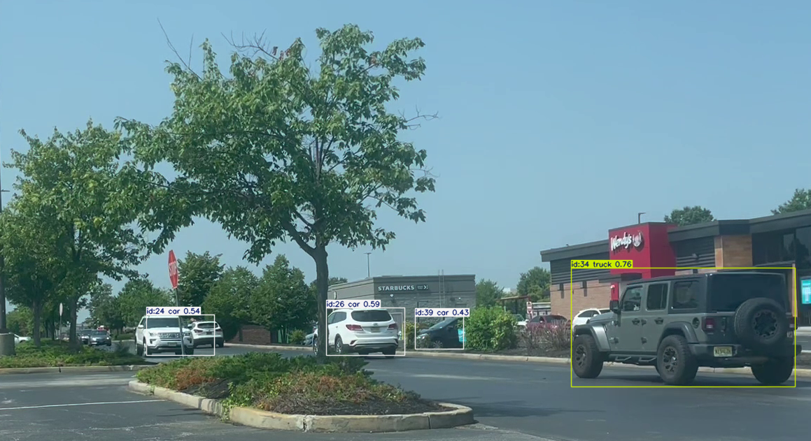

# 🚗 Real-Time Object Tracking with YOLOv8

In this project, I developed a real-time object detection and tracking pipeline using **YOLOv8** and **ByteTrack**. The system processes video input frame by frame, assigns persistent IDs to detected objects, and exports an annotated output video.

---

## 🚀 Project Summary

| | |
|---|---|
| **Model** | YOLOv8n (Nano) — Pre-trained on COCO dataset |
| **Tracker** | ByteTrack |
| **Task** | Multi-object detection & tracking |
| **Input** | Video file (.MOV, .mp4, etc.) |
| **Output** | Annotated video with bounding boxes and tracking IDs |

---

## 🖼️ Sample Output



Each detected object is assigned a **persistent tracking ID** across frames. The model detects multiple object classes (car, truck, person, etc.) with confidence scores displayed on each bounding box.

---

## 🧠 How It Works

The pipeline processes video frame by frame:

1. **Frame Reading** — OpenCV reads each frame from the input video
2. **YOLOv8 Detection** — YOLOv8 detects objects in the current frame
3. **ByteTrack Tracking** — ByteTrack assigns and maintains consistent IDs across frames
4. **Annotation** — Bounding boxes, class labels, confidence scores, and IDs are drawn
5. **Export** — Annotated frames are written to `output.mp4`

---

## ⚙️ Model & Tracker Configuration

| Parameter | Value | Description |
|---|---|---|
| `conf` | 0.3 | Minimum confidence score threshold (0–1) |
| `iou` | 0.5 | Intersection over Union threshold for box overlap |
| `persist` | True | Keeps tracking IDs consistent across frames |
| `tracker` | bytetrack.yaml | ByteTrack algorithm configuration |

---

## 🛠️ Installation & Usage

```bash
# 1. Clone the repository
git clone https://github.com/BetulBilecen/DL-Image-Processing-Projects.git

# 2. Install dependencies
pip install -r requirements.txt

# 3. Download the dataset from Kaggle and place the video(s) in the project folder
# https://www.kaggle.com/datasets/benjaminguerrieri/car-detection-videos

# 4. Run the tracking script
python yolo_tracking.py
```

> ⚠️ The script will display the tracking output in a window. Press **`q`** to stop early. The result is saved as `output.mp4` in the project folder.

---

## 🔧 Error Handling

The script includes robust error handling for common issues:

| Exception | Handling |
|---|---|
| `FileNotFoundError` | Raised if the video file cannot be opened |
| `KeyboardInterrupt` | Graceful exit when the user force-closes |
| `Exception` | Catches any unexpected runtime errors |
| `finally` block | Always releases video reader, writer, and closes windows |

---

## 📦 Technologies Used

| Library | Purpose |
|---|---|
| **Python** | Core programming language |
| **Ultralytics YOLOv8** | Object detection model |
| **OpenCV** | Video reading, frame processing, display |
| **ByteTrack** | Multi-object tracking algorithm |
