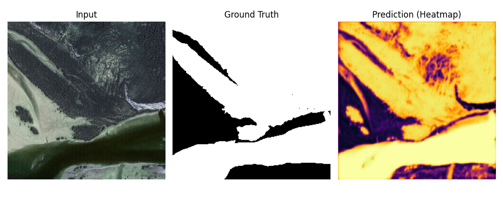
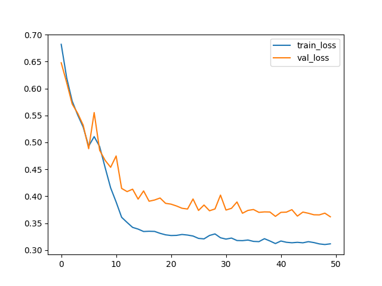

# 🛰️ Satellite Image Segmentation using U-Net

In this project, I developed a semantic segmentation model to detect and segment regions of interest from aerial/satellite imagery using the U-Net architecture. The model learns to produce binary segmentation masks from RGB satellite images.

---

## 🚀 Project Summary

- **Model Architecture:** U-Net (Encoder-Decoder with Skip Connections)
- **Dataset:** Aerial Image Dataset (aerial_dataset)
- **Task:** Binary semantic segmentation (region of interest vs. background)
- **Total Samples:** 72 (57 training / 15 validation)
- **Input Size:** 256×256×3
- **Training:** 50 epochs, batch size 16
- **Final Training Accuracy:** ~%87.00
- **Final Validation Accuracy:** ~%84.04

---

## 🖼️ 1. Sample Prediction

The model takes a satellite image as input and produces a heatmap showing the predicted segmentation mask alongside the ground truth.



---

## 🧠 2. Model Architecture

U-Net consists of two main paths: an **Encoder** that extracts features by downsampling, and a **Decoder** that reconstructs the spatial resolution through upsampling. Skip connections between encoder and decoder help preserve fine-grained spatial details.

### Encoder (Downsampling Path)

| Block | Filters | Output Size |
|---|---|---|
| Conv2D × 2 | 16 | 256×256 |
| MaxPooling | — | 128×128 |
| Conv2D × 2 | 32 | 128×128 |
| MaxPooling | — | 64×64 |
| Conv2D × 2 | 64 | 64×64 |
| MaxPooling | — | 32×32 |
| Conv2D × 2 | 128 | 32×32 |
| MaxPooling | — | 16×16 |
| Conv2D × 2 (Bottleneck) | 256 | 16×16 |

### Decoder (Upsampling Path)

| Block | Filters | Output Size |
|---|---|---|
| Conv2DTranspose + Skip | 128 | 32×32 |
| Conv2D × 2 | 128 | 32×32 |
| Conv2DTranspose + Skip | 64 | 64×64 |
| Conv2D × 2 | 64 | 64×64 |
| Conv2DTranspose + Skip | 32 | 128×128 |
| Conv2D × 2 | 32 | 128×128 |
| Conv2DTranspose + Skip | 16 | 256×256 |
| Conv2D × 2 | 16 | 256×256 |
| Conv2D (Output, Sigmoid) | 1 | 256×256 |

> **Skip Connections:** Each decoder block receives feature maps from its corresponding encoder block, allowing the model to recover spatial details lost during downsampling.

---

## ⚙️ 3. Data Preprocessing

The dataset is organized in tile-based folders, each containing an `images/` and a `masks/` subfolder.

- **Image loading:** BGR → RGB conversion via OpenCV
- **Resizing:** All images resized to 256×256
- **Normalization:** Pixel values scaled to [0, 1]
- **Mask binarization:** Threshold at 127 → binary mask (0 or 1)
- **Train/Validation split:** 80% training / 20% validation

---

## 📈 4. Training Results

The model was trained for 50 epochs with the following callbacks: `ModelCheckpoint`, `ReduceLROnPlateau`, and `EarlyStopping (patience=10)`.

| Epoch | Train Accuracy | Val Accuracy | Train Loss | Val Loss |
|---|---|---|---|---|
| 1  | %51.33 | %59.99 | 0.6819 | 0.6477 |
| 10 | %83.74 | %79.81 | 0.4156 | 0.4538 |
| 20 | %86.37 | %82.68 | 0.3285 | 0.3870 |
| 30 | %86.48 | %81.14 | 0.3231 | 0.4022 |
| 40 | %87.04 | %84.27 | 0.3123 | 0.3628 |
| 50 | %87.00 | %84.04 | 0.3118 | 0.3620 |



---

## 🛠️ Installation & Usage

```bash
# 1. Clone the repository
git clone https://github.com/BetulBilecen/Satellite-Image-Segmentation-UNet.git

# 2. Install dependencies
pip install tensorflow keras opencv-python numpy matplotlib scikit-learn

# 3. Place your dataset in the project folder
# Expected structure:
# aerial_dataset/
#   tile1/
#     images/  → .jpg files
#     masks/   → .png files

# 4. Run the training script
python main.py
```

---

## 📦 Technologies Used

- **Python** — Core programming language
- **TensorFlow & Keras** — Deep learning model
- **OpenCV** — Image loading and preprocessing
- **NumPy** — Numerical operations
- **Matplotlib** — Visualization
- **Scikit-Learn** — Train/validation split

---

> **Note:** I developed this project as part of my learning journey on the **BTK Academy** platform. While the documentation is in English for global accessibility, the code comments remain in Turkish as they reflect my original study notes.